# Lab 4 - Morphological Image Processing
## Amy Brons - Design of Visual Systems
Below is the logbook for Lab 4, and the full MATLAB code for this lab can be found in attached MATLAB file. 

## Task 1: Dilation and Erosion
Matlab provides a collection of morphological functions. Here is a list of them:
<p align="center"> 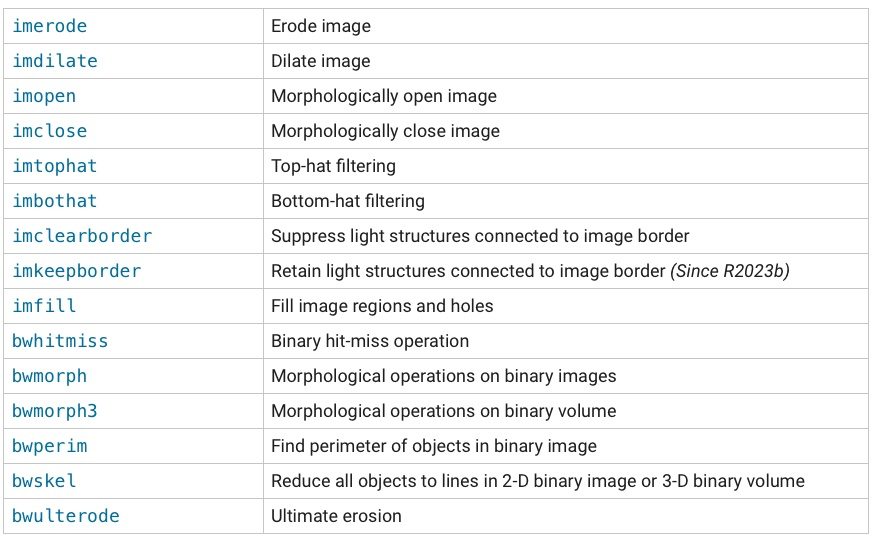 </p>

### Dilation Operation
Input
```
A = imread('assets/text-broken.tif');
B1 = [0 1 0;
     1 1 1;
     0 1 0];   
A1 = imdilate(A, B1);
montage({A,A1})
```
Output
<p align="center"> 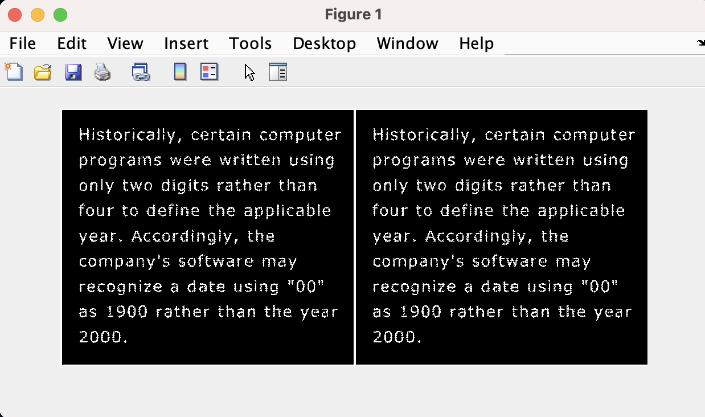 </p>

> Change the structuring element (SE) to all 1's:
Input
```
A = imread('assets/text-broken.tif');
B1 = ones(3,3);   
A1 = imdilate(A, B1);
montage({A,A1})
```
Output
<p align="center"> 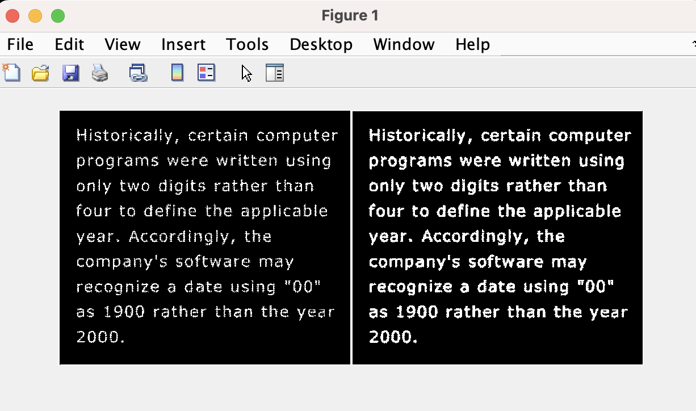 </p>


> Try making the SE larger.
> Try to make the SE diagonal cross:
Input
```
A = imread('assets/text-broken.tif');
B1 = [1 0 1;
    0 1 0;
    1 0 1];
A1 = imdilate(A, B1);
montage({A,A1})
```
Output
<p align="center"> 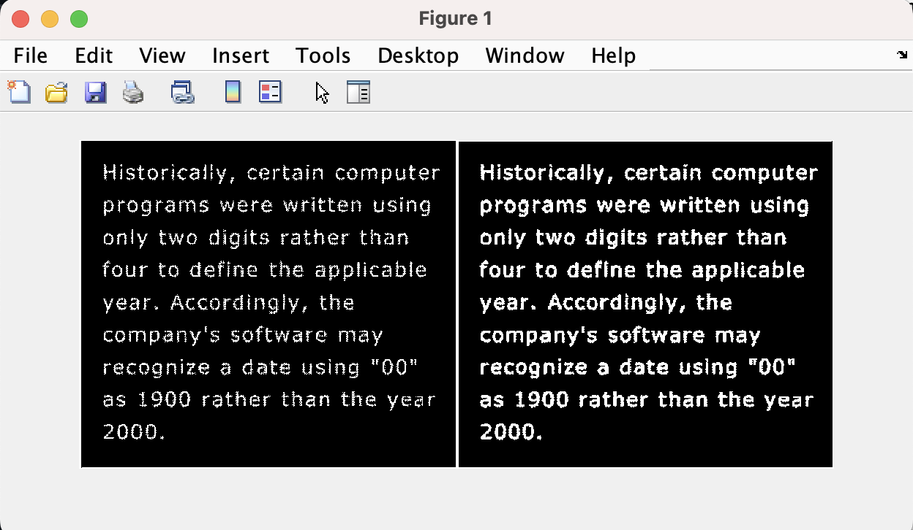 </p>

> What happens if you dilate the original image with B1 twice (or more times)?
Input
```
A = imread('assets/text-broken.tif');
B1 = [0 1 0;
     1 1 1;
     0 1 0];    % create structuring element
A1 = imdilate(A, B1);
A2 = imdilate(A1,B1);
A3 = imdilate(A2,B1);
montage({A,A1,A2,A3})
```
Output
<p align="center"> 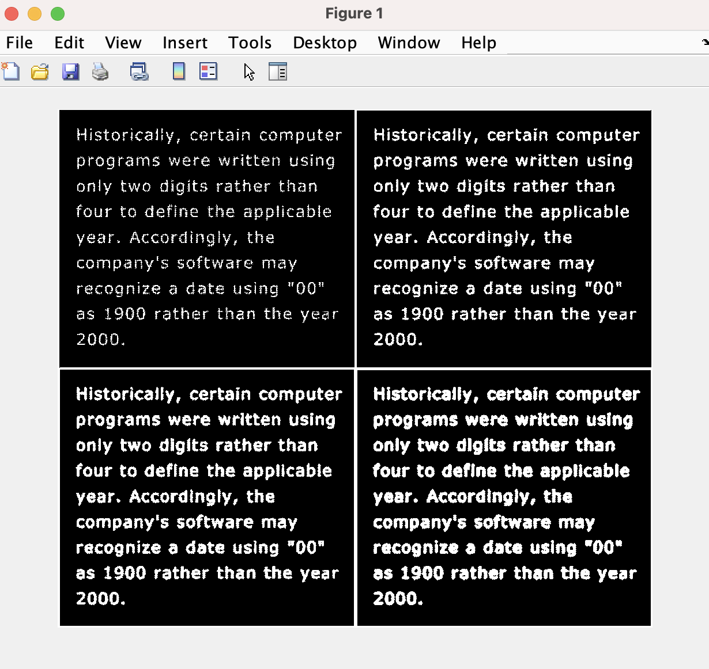 </p>

### Generation of structuring element

For spatial filtering, we used function _fspecial_ to generate our filter kernel.  For morphological operations, we use function _strel_ to generate different kinds of structuring elements.

Here is a list of SE that _strel_ can generate:
<p align="center"> 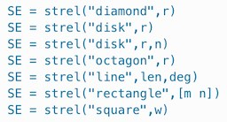 </p>

Input
```
SE = strel('disk',4);
SE.Neighborhood         % print the SE neighborhood contents
```
Output (not an  array, but a data structure)
ans =

  7×7 logical array

   0   0   1   1   1   0   0
   0   1   1   1   1   1   0
   1   1   1   1   1   1   1
   1   1   1   1   1   1   1
   1   1   1   1   1   1   1
   0   1   1   1   1   1   0
   0   0   1   1   1   0   0


### Erosion Operation

Input
```
clear all
close all
A = imread('assets/wirebond-mask.tif');
SE2 = strel('disk',2);
SE10 = strel('disk',10);
SE20 = strel('disk',20);
E2 = imerode(A,SE2);
E10 = imerode(A,SE10);
E20 = imerode(A,SE20);
montage({A, E2, E10, E20}, "size", [2 2])
```
Output
<p align="center"> 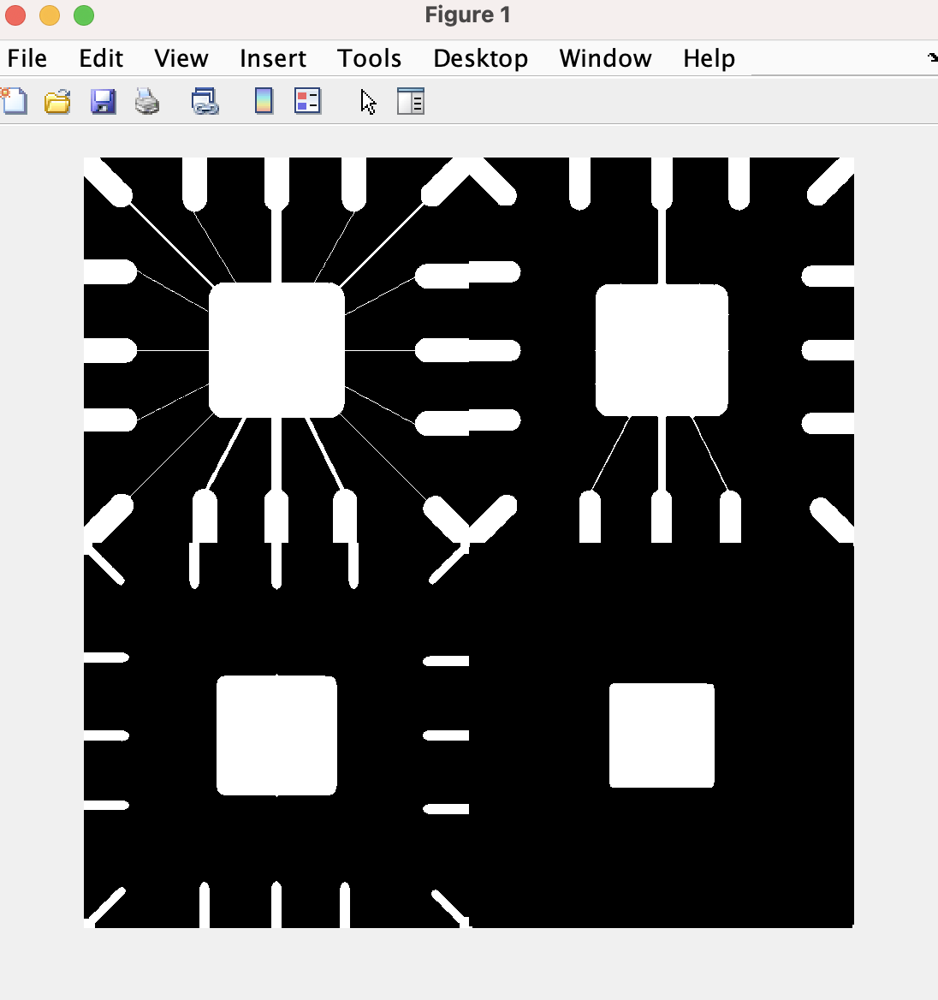 </p>

Comments:
- See how repeated erosion removes lines
- Smaller lines are removed first
- Larger objects are reduced in size

  
## Task 2 - Morphological Filtering with Open and Close

### Opening = Erosion + Dilation
Task
1. Read the image file 'finger-noisy.tif' into f.
2. Generate a 3x3 structuring element SE.
3. Erode f to produce _f_e.
4. Dilate fe to produce fed.
5. Open f to produce fo.
6. Show f, fe, fed and fo as a 4 image montage.

Input
```
clear all
close all
f = imread('assets/fingerprint-noisy.tif');
SE = strel('disk',3);
fe = imerode(f,SE);
fed = imdilate(fe,SE);
fo = imopen(fed,SE);
montage({f, fe, fed, fo}, "size", [2 2])
```

Output
<p align="center"> 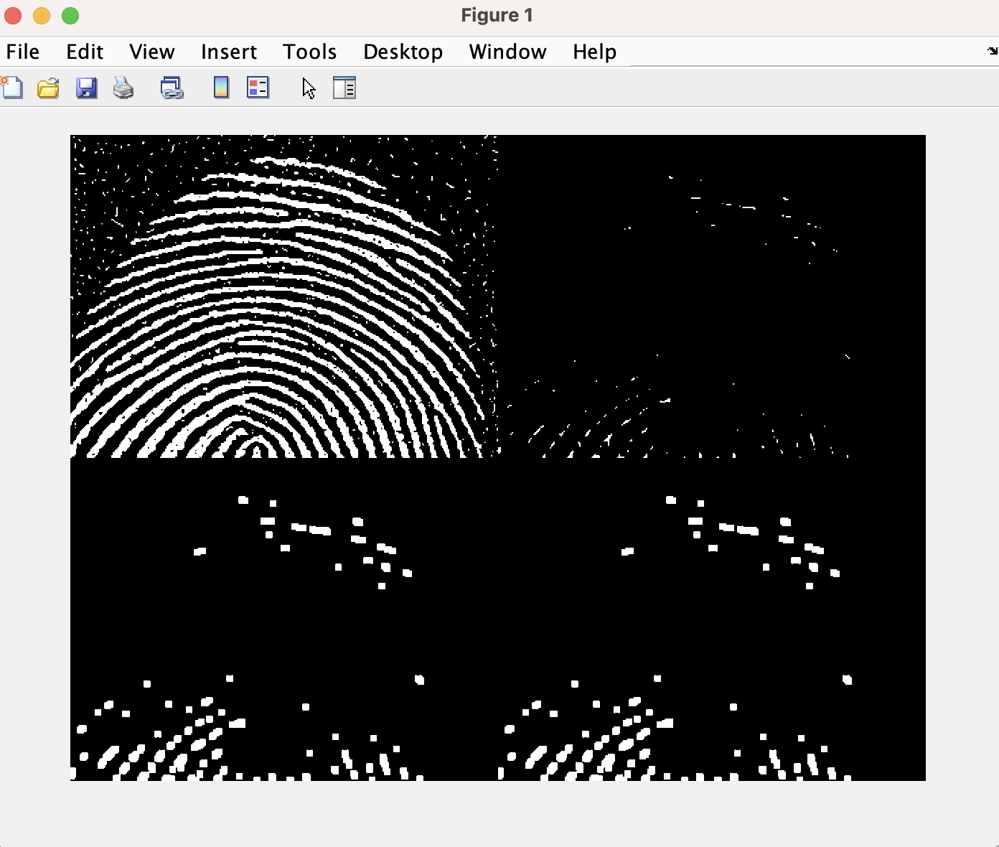 </p>

Comments:
- The initial erosion gets rid of too much detail and removes almost all identifiers
- The dilate expands the remaining data
- The opening has little effect, slightly further expanding the data

Explore what happens with other size and shape of structuring element version 1:
Input
```
clear all
close all
f = imread('assets/fingerprint-noisy.tif');
SE =ones(3,3);
fe = imerode(f,SE);
fed = imdilate(fe,SE);
fo = imopen(fed,SE);
montage({f, fe, fed, fo}, "size", [2 2])
```

Output
<p align="center"> 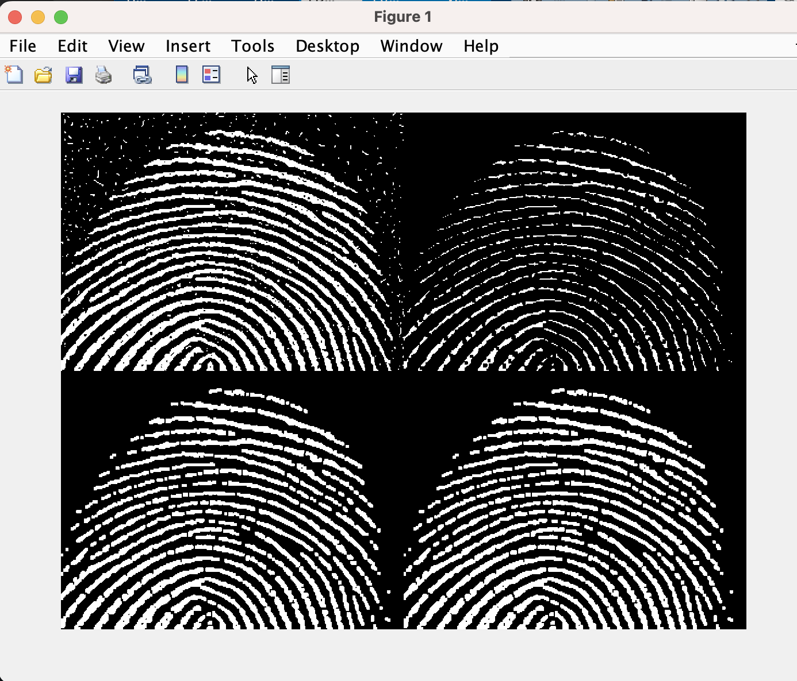 </p>

Explore what happens with other size and shape of structuring element version 2:

Input
```
f = imread('assets/fingerprint-noisy.tif');
SE =[0 1 0;
    1 1 1 ;
    0 1 0];
fe = imerode(f,SE);
fed = imdilate(fe,SE);
fo = imopen(fed,SE);
montage({f, fe, fed, fo}, "size", [2 2])
```

Output
<p align="center"> 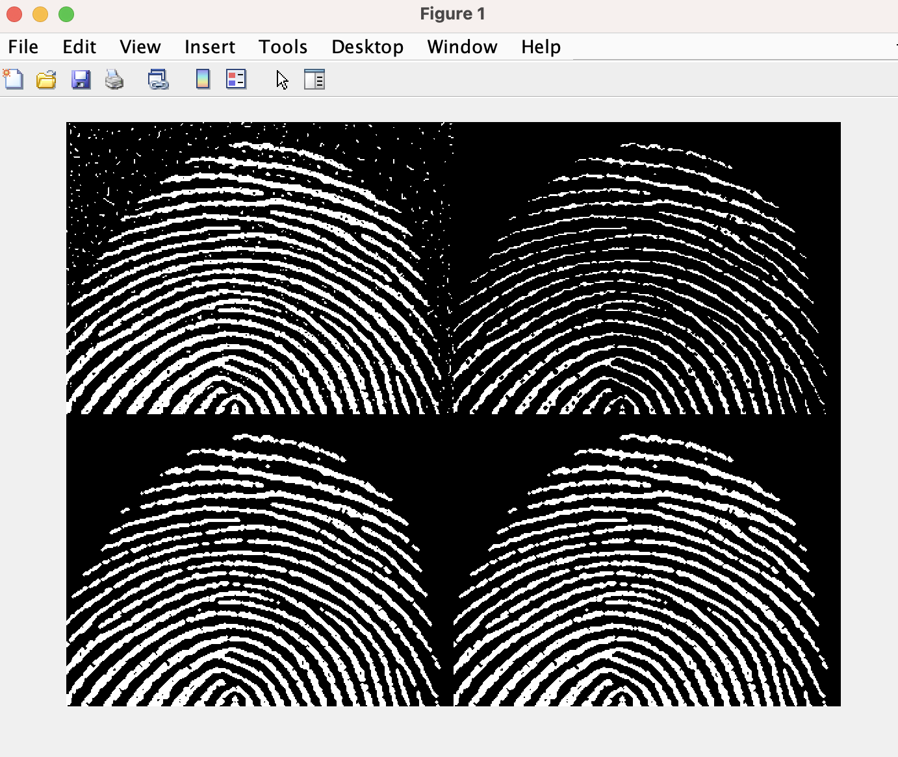 </p>

Improve the image _fo__ with a close operation:

Input
```
clear all
close all
f = imread('assets/fingerprint-noisy.tif');
SE = ones(3,3);
fe = imerode(f,SE);
fed = imdilate(fe,SE);
fo = imopen(fed,SE);
fo = imclose(fo,SE);
montage({f, fe, fed, fo}, "size", [2 2])
```

Output
<p align="center"> 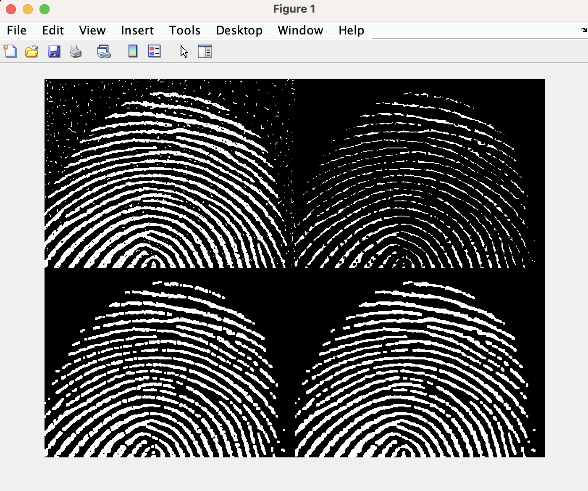 </p>


Finally, compare morphological filtering using Open + Close to spatial filter with a **Gaussian filter**:

Input
```
clear all
close all
f = imread('assets/fingerprint-noisy.tif');
SE = ones(3,3);
fe = imopen(f,SE);
fo = imclose(fe,SE);
gaus = fspecial('Gaussian', [7 7], 1.0)
fu = imfilter(f,gaus,0);
montage({fo, fu})
```
Output
<p align="center"> 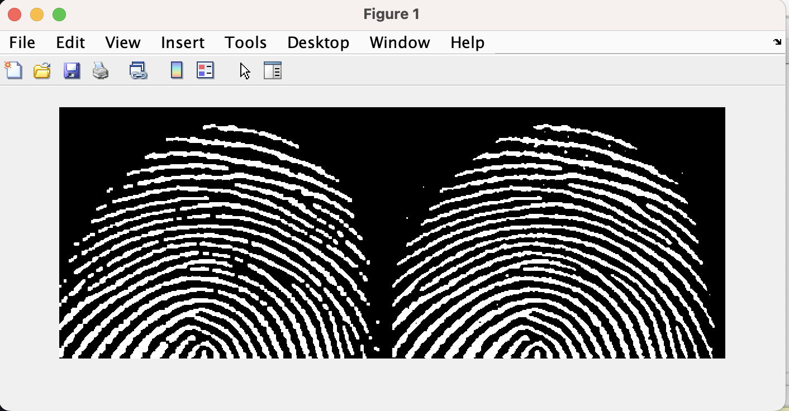 </p>

Comments:
- Gaussian filter generally left more noise, but got rid of less important data
- Open/close did result in some cracking in the image forms
- Gaussian looks more clear


## Task 3 - Boundary detection 
First we turn this "inverted" grayscale image into a binary image with white objects (blobs) and black background.

Input
```
clear all
close all
I = imread('assets/blobs.tif');
I = imcomplement(I);
level = graythresh(I);
BW = imbinarize(I, level);
imshow(BW)
```

Output
<p align="center"> 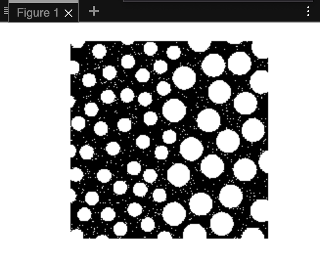 </p>

Diplay as montage {I, BW, erosed BW and boundary detected image}:

Input
```
clear all
close all
I = imread('assets/blobs.tif');
I = imcomplement(I);
level = graythresh(I);
BW = imbinarize(I, level); 
SE = ones(3,3);
BW_eroded = imerode(BW, SE);
BW_boundary = BW - BW_eroded;
montage({I,BW,BW_eroded,BW_boundary})  
```

Output
<p align="center"> 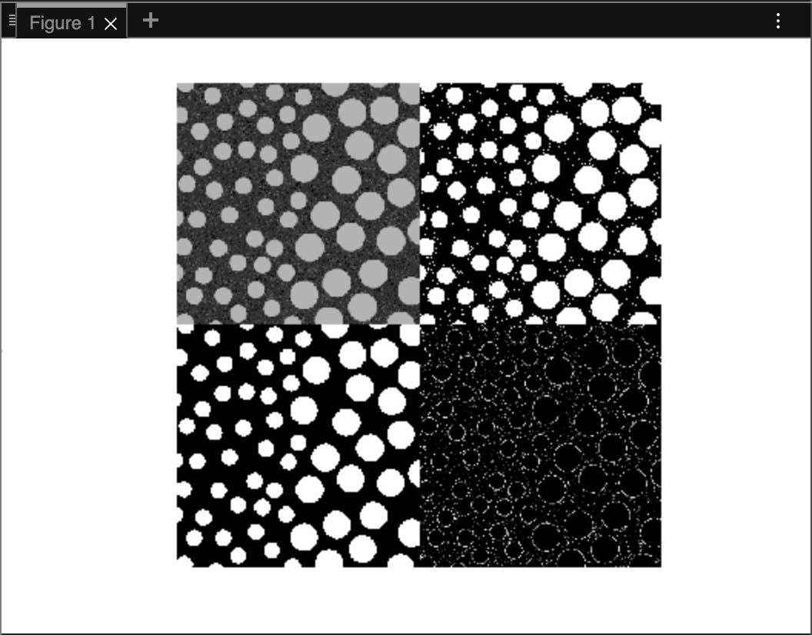 </p>

Comments:
- The detection highlights the edges effectively.
- Noise is an issue.
- To improve, we can may apply morphological operations (opening, etc.)
- The structuring element could also improve the output


Here is an example with open applied:
<p align="center"> 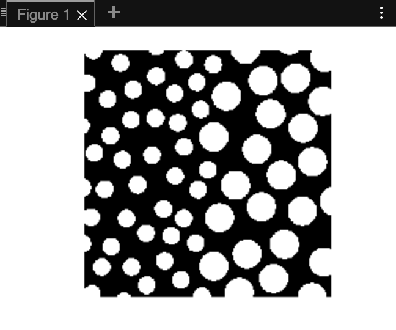 </p>


## Task 4 - Function bwmorph - thinning and thickening

1. Read the image file 'fingerprint.tif' into *_f_*.
2. Turn this into a good binary image using method from the previous task. 
3. Perform thinning operation 1, 2, 3, 4 and 5 times, storing results in g1, g2 ... etc.
4. Montage the unthinned and thinned images to compare.

Input
```
f = imread('fingerprint.tif');
f = imcomplement(f); % Invert grayscale image
level = graythresh(f);
BW_f = imbinarize(f, level); % Convert to binary image
g1 = bwmorph(BW_f, 'thin', 1);
g2 = bwmorph(BW_f, 'thin', 2);
g3 = bwmorph(BW_f, 'thin', 3);
g4 = bwmorph(BW_f, 'thin', 4);
g5 = bwmorph(BW_f, 'thin', 5);

montage({f,g1,g2,g3,g4,g5})
```

Output
<p align="center"> 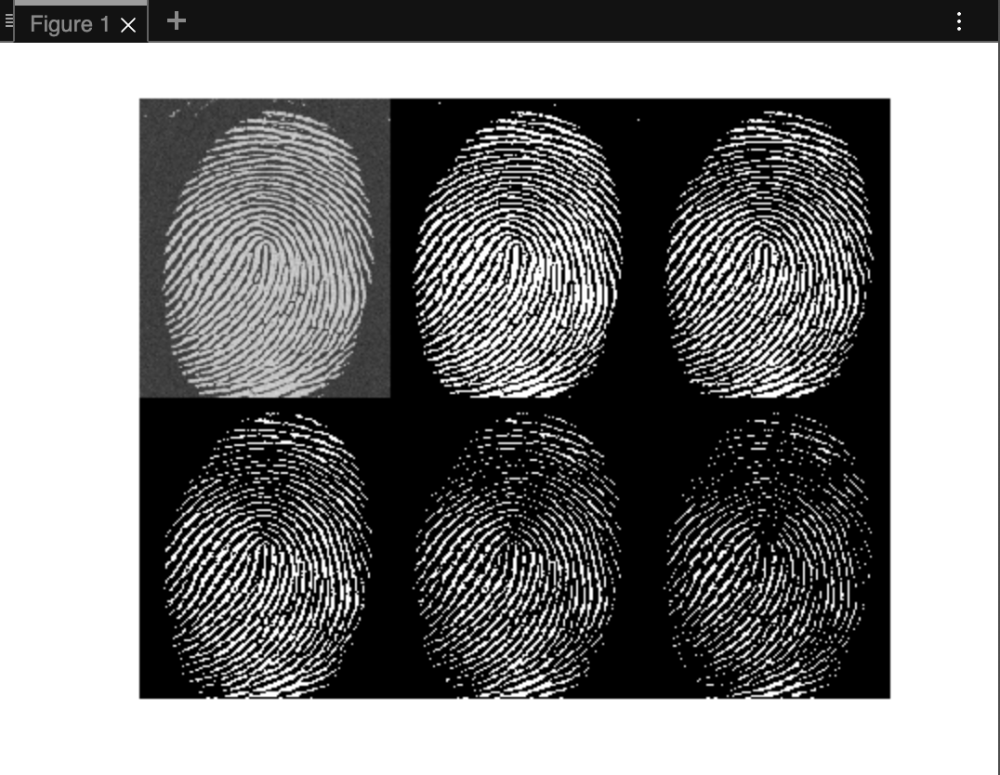 </p>

Comments:
- Reduced structures and thinned lines, which makes fingerprint distinctions less and less recognizable
- Finding differences between lines becomes more difficult

What will happen if you keep thinning the image?:
Input added
```
g_inf = bwmorph(BW_f, 'thin', inf);
```

Output
<p align="center"> 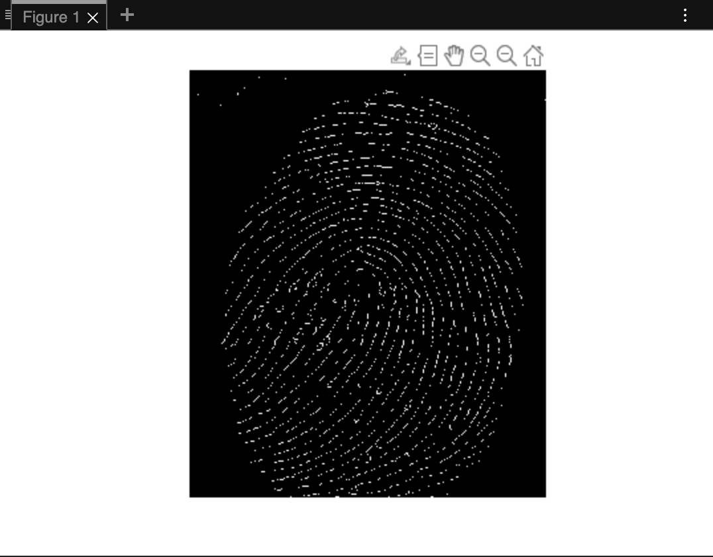 </p>

Modify your matlab code so that the fingerprint is displayed black lines on white background instead of white on black:
Input added
```
BW_f = imcomplement(BW_f)
```

Output
<p align="center"> 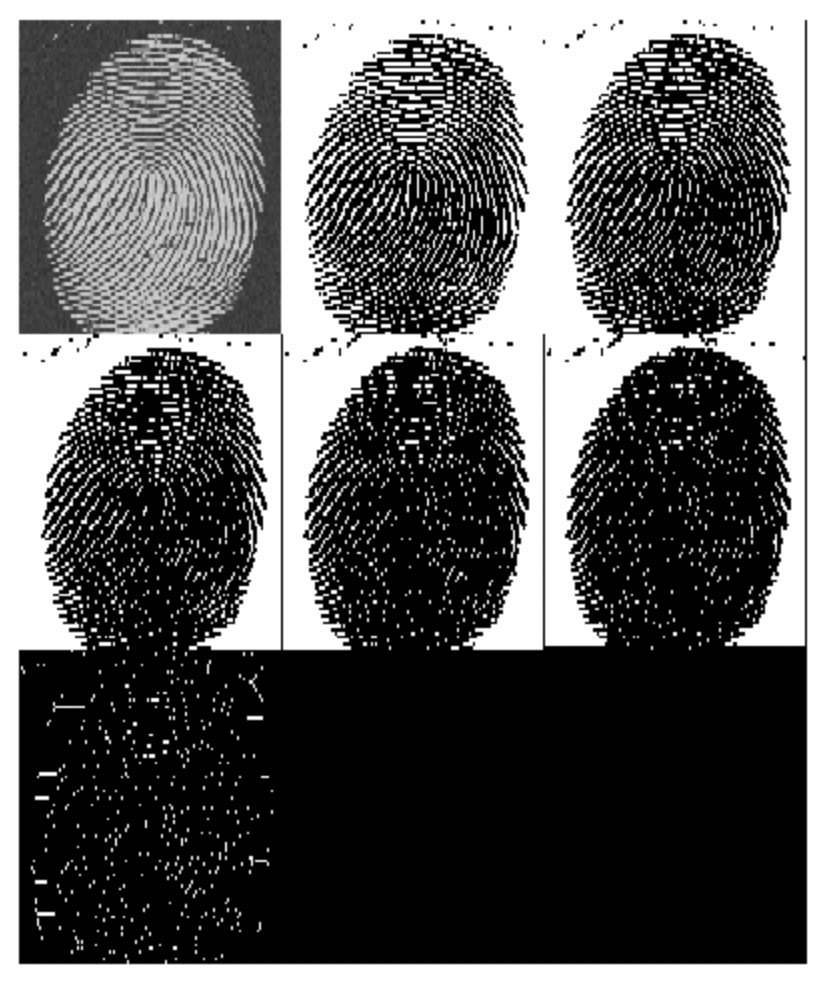 </p>


What conclusion can you draw about the relationship between thinning and thickening?
- Thinning is important when reducing and identfying boundaries and boarders in connected structures
- Thinning reduces images to a skeleton
- Thickening grows structures and may halep in forming boundaries and boarders
- Thickening enhances intended shapes and identifies broken shapes
- Repeating either of these operations can be useful for identfying underlining shapes
- Repeating either of these too many times will destroy crucial data
- Together these operations can be used to find important data, but must be used strategically


## Task 5 - Connected Components and labels
Toolbox the function bwconncomp which performs the morphological operation.

Input
```
t = imread('assets/text.png');
imshow(t)
CC = bwconncomp(t)
```
Output
<p align="center"> 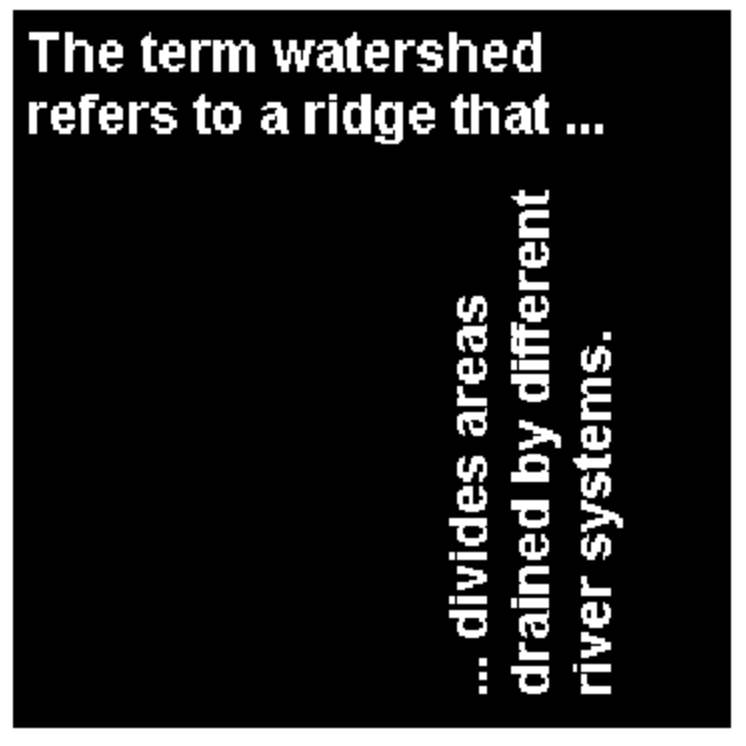 </p>


To determine which is the largest component:

Input
```
numPixels = cellfun(@numel, CC.PixelIdxList);
[biggest, idx] = max(numPixels);
t(CC.PixelIdxList{idx}) = 0;
figure
imshow(t)
```

Output
<p align="center"> 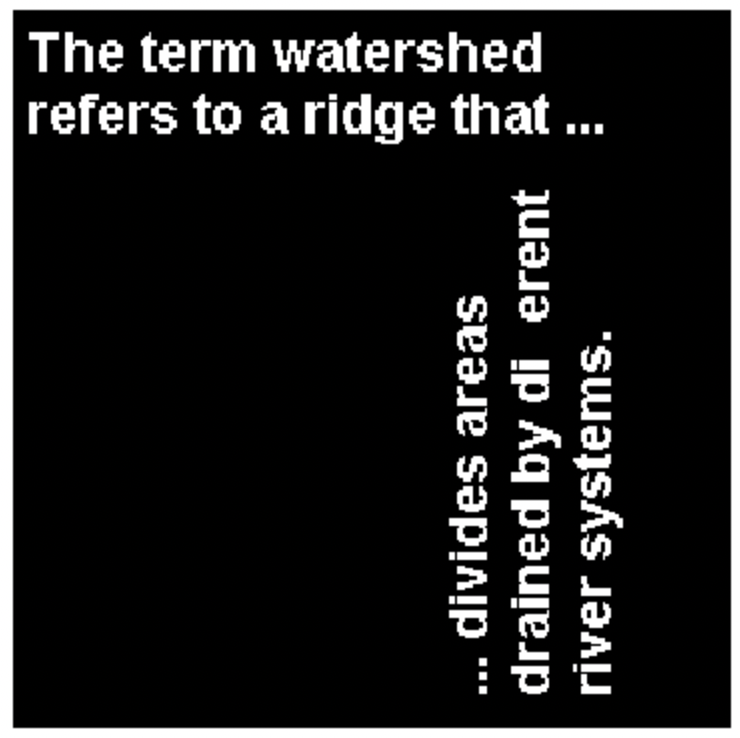 </p>


## Task 6 - Morphological Reconstruction
1. Find the marker image g by eroding the mask with an se that mark the places where the desirable features are located. In our case, the desired characters are all with long vertical elements that are 17 pixels tall. Therefore the se used for erosion is a 17x1 of 1's.
2. Apply the reconstruction operation using Matlab's imreconstruct functino between the marker g and the mask f.

Input
```
clear all
close all
f = imread('assets/text_bw.tif');
se = ones(17,1);
g = imerode(f, se);
fo = imopen(f, se);     
fr = imreconstruct(g, f);
montage({f, g, fo, fr}, "size", [2 2])
```

Output
<p align="center"> 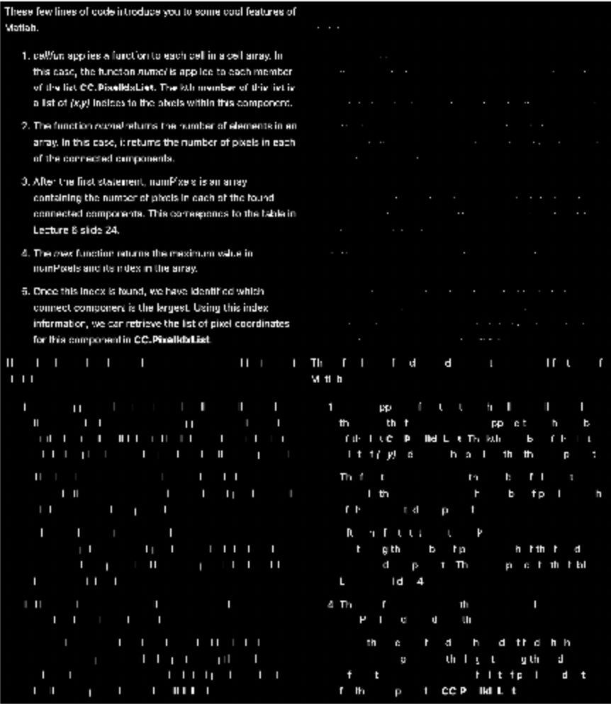 </p>

Comments:
- Initial image is quite blurry and hard to read, lots of lost data
- After eroding, there is almost no data left, only few dots and noise
- Opening identifies tall letters and maintains the vertical lines of many letters
- Reconstructing allows for semi-formation fo some letters but maintains nonsense in reading

Also try the function **_imfill_**:

Input
```
ff = imfill(f);
figure
montage({f, ff})
```

Output
<p align="center"> 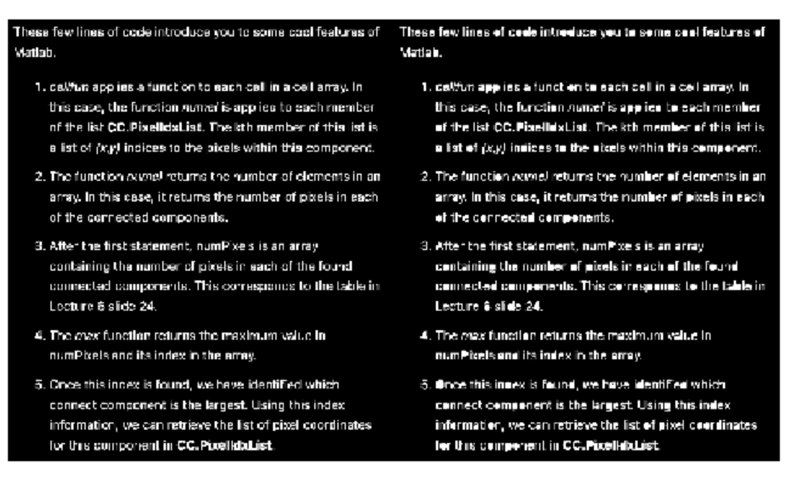 </p>

Comments:
- Fill leads to more confusion in reading as circular letters get filled in
- Some improvement on contrast and added thickness of lines

## Task 7 - Morphological Operations on Grayscale images
In this task, we will explore the effect of erosion and dilation on grayscale images:

Input
```
clear all; close all;
f = imread('assets/headCT.tif');
se = strel('square',3);
gd = imdilate(f, se);
ge = imerode(f, se);
gg = gd - ge;
montage({f, gd, ge, gg}, 'size', [2 2])
```

Output
<p align="center"> 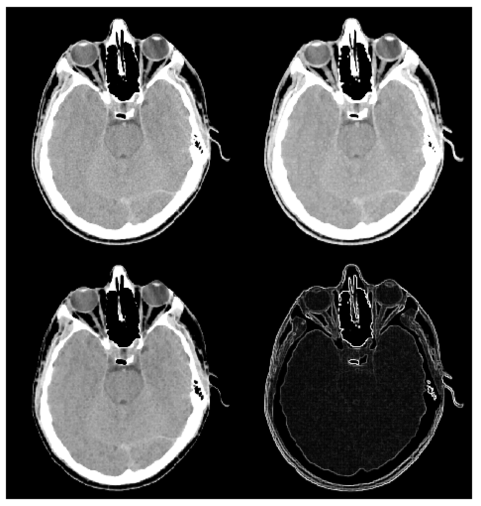 </p>

Comments:
- After dialtion, the CT scan seems more bright and clear, but dark spots seem to lack the same depth. Some clarity is lost on external edges
- After erosion, the scan rids of some external and border data. This could prove useful if trying to identify edges, but may lose some crucial data if need corners
- Subtracting the erosion from the dialation seems effective at identfying boarders and key shapes. Important data seems perserves and it is easeir to read the intensity of shapes, and key issues


## Challenges 

1. The grayscale image file _'assets/fillings.tif'_ is a dental X-ray corrupted by noise.  Find how many fills this patient has and their sizes in number of pixels.
Answer:
This code applies thresholding and morphological opening to clean the image, detects and counts the number of dental fillings, and displays the cleaned image with the filling count.

Input
```
f = imread('assets/fillings.tif');
level = graythresh(f);
BW_fillings = imbinarize(f, level);

se = strel('disk', 3);
BW_fillings_cleaned = imopen(BW_fillings, se);

CC_fillings = bwconncomp(BW_fillings_cleaned);
numFillings = CC_fillings.NumObjects;
numPixelsFillings = cellfun(@numel, CC_fillings.PixelIdxList);

montage({f, BW_fillings_cleaned})
title(['Number of fillings: ', num2str(numFillings)]);```

```
Output
<p align="center"> 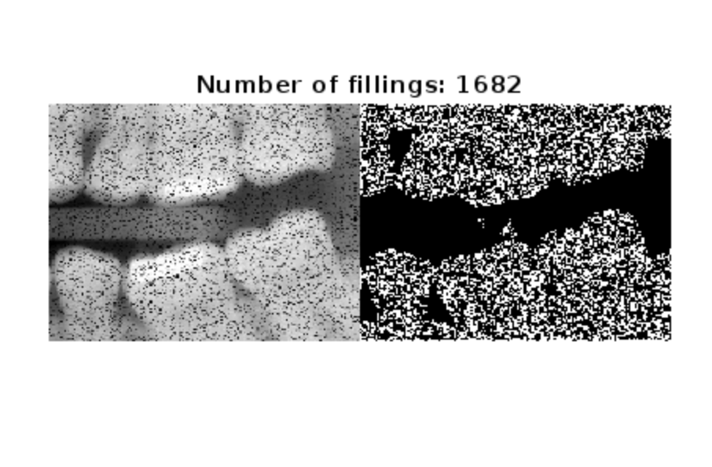 </p>


2. The file _'assets/palm.tif'_ is a palm print image in grayscale. Produce an output image that contains the main lines without all the underlining non-characteristic lines.
Answer: This code binarizes, applies erosion and morphological opening to remove unwanted noise, identifies and removes the largest connected component, and displays the modified image.

Input
```
f = imread("palm.jpg")
level = graythresh(f);
BW = imbinarize(f, level); 
SE = ones(3,3);
BW_eroded = imerode(BW, SE);
BW_open = imopen(BW_eroded, SE); 
CC = bwconncomp(BW_open)
numPixels = cellfun(@numel, CC.PixelIdxList);
[biggest, idx] = max(numPixels);
f(CC.PixelIdxList{idx}) = 0;
imshow(f)
```
<p align="center"> 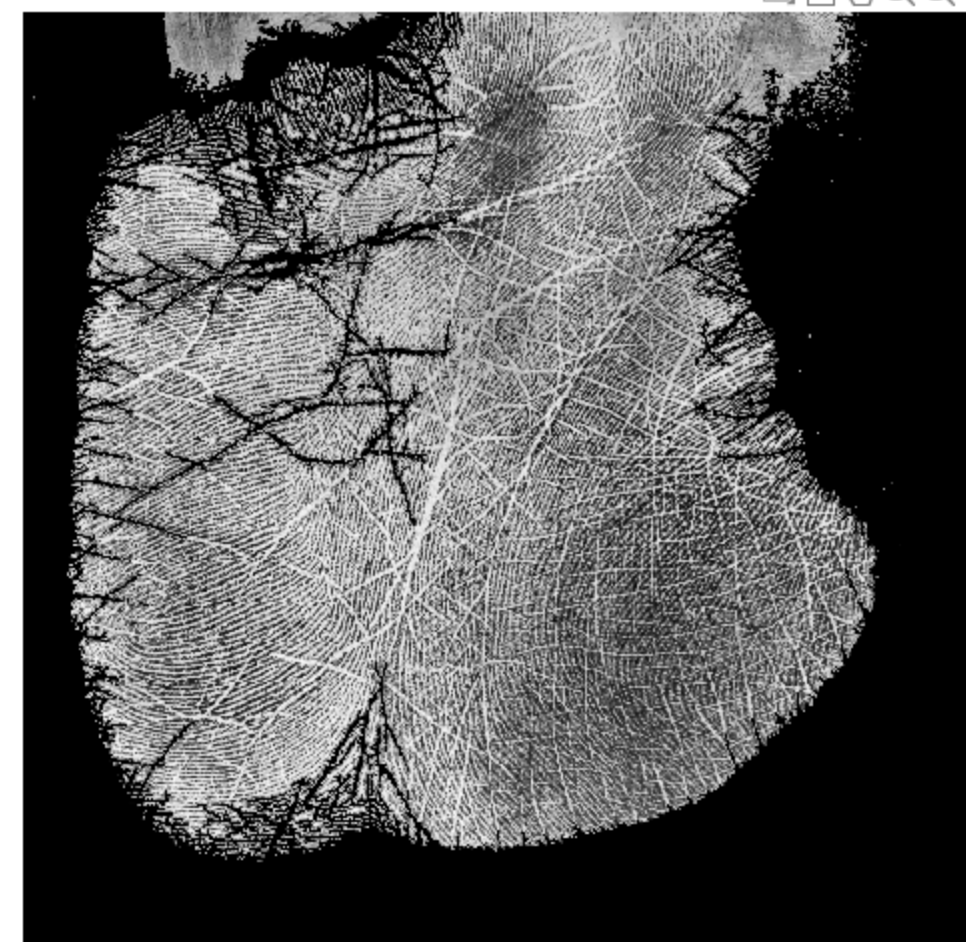 </p>


3. The file _'assets/normal-blood.png'_ is a microscope image of red blood cells. Using various techniques you have learned, write a Matlab .m script to count the number of red blood cells.
Answer: This code converts a microscope image of red blood cells into a binary format, removes small noise using morphological opening, counts the number of detected cells, and displays the original image with the count in the title.

Input
```
f = imread('assets/normal-blood.png');
level = graythresh(f);
BW_blood = imbinarize(f, level);
se3 = strel('disk', 2);
BW_blood_cleaned = imopen(BW_blood, se3);
CC_blood = bwconncomp(BW_blood_cleaned);
numCells = CC_blood.NumObjects;
imshow(f);
title(['Number of Red Blood Cells: ', num2str(numCells)]);
```
Output
<p align="center"> 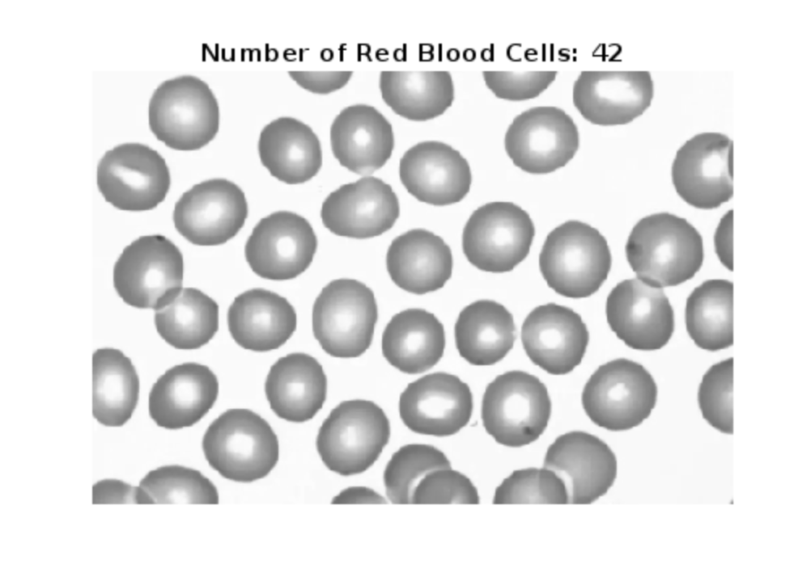 </p>
